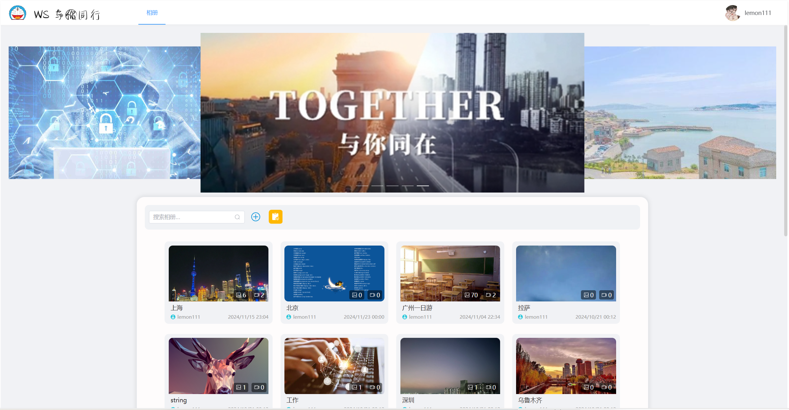
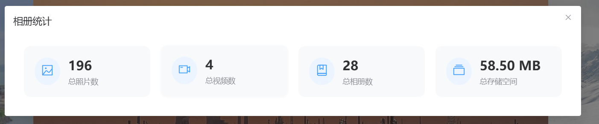
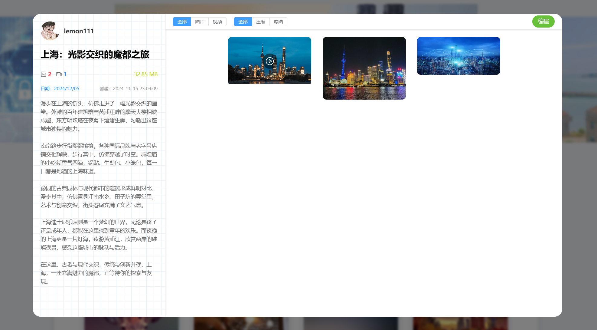
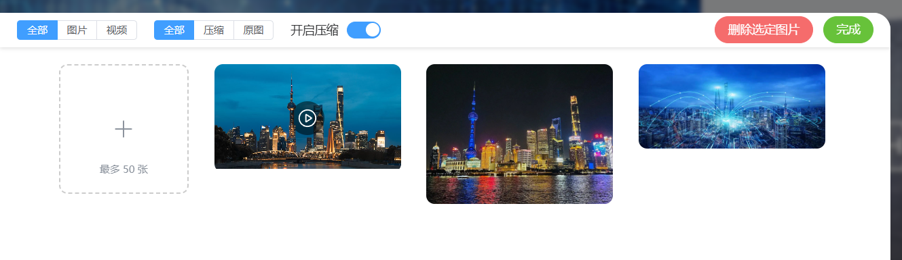

# ws-home

## 项目简介

本项目是一个基于 Vue 3 开发的个人相册管理系统,提供相册创建、图片/视频上传、相册管理等功能。
> [前往后端仓库](https://github.com/lemon-puls/ws-home-backend)

主要特点:
- 支持创建多个相册,并为每个相册设置封面、标题和描述
- 支持图片和视频的批量上传,自动压缩优化
- 支持相册内容的编辑、删除等管理功能
- 支持按照媒体类型(图片/视频)和压缩状态进行筛选
- 支持查看相册统计数据

## 项目演示
### 主页

### 统计数据

### 相册详情

### 媒体上传

### 视频播放


## 技术栈

### 前端

- Vue 3 - 渐进式 JavaScript 框架
- TypeScript - JavaScript 的超集,提供类型系统
- Vite - 下一代前端构建工具
- Element Plus - 基于 Vue 3 的组件库
- Pinia - Vue 的状态管理库
- Vue Router - Vue.js 的官方路由
- Sass - CSS 预处理器

### 存储

- 腾讯云 COS - 对象存储服务,用于存储图片和视频文件

### 工具库

- openapi-typescript-codegen - 用于生成 TypeScript API 客户端代码  [github 仓库地址](https://github.com/ferdikoomen/openapi-typescript-codegen)
- cos-js-sdk-v5 - 腾讯云 COS JavaScript SDK

## 开发环境搭建

### 前置要求

- Node.js >= 16
- npm >= 8
- 腾讯云 COS 账号和配置

### 步骤

1. 克隆项目:

```bash
git clone https://github.com/your-username/ws-home.git
cd ws-home
```

2. 安装依赖:

```bash
npm install
```

3. 配置环境变量:

把项目根目录的 .env.sample 重命名（或先复制）为 `.env` 文件，然后填写配置。

4. 生成 API 客户端代码:

```bash
openapi --input http://localhost:8080/swagger/doc.json --output ./generated --client axios
```

5. 启动项目:

```bash
npm run dev
```

6. 构建生产版本:

```bash
npm run build
```

### 目录结构

```
ws-home/
├── src/                    # 源代码目录
│   ├── components/        # 组件
│   ├── views/            # 页面
│   ├── stores/           # Pinia 状态管理
│   ├── utils/            # 工具函数
│   ├── styles/           # 样式文件
│   └── router/           # 路由配置
├── public/               # 静态资源
├── generated/            # 生成的 API 客户端代码
├── .env.local           # 本地环境变量
└── package.json         # 项目配置文件
```
